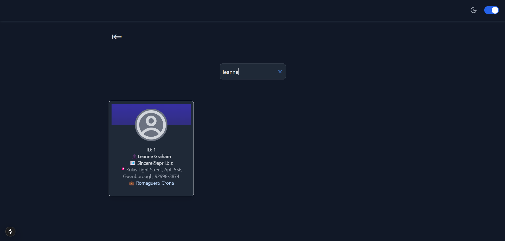
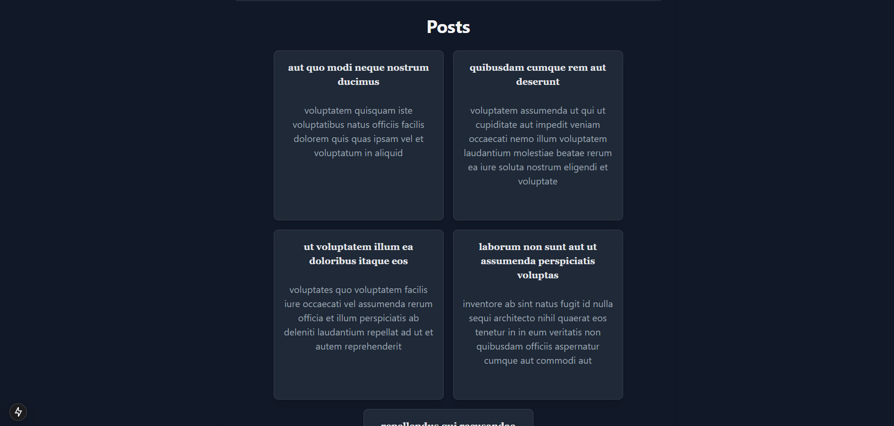

# Users & Posts Dashboard - Next.js Application

## Overview
This project is a Next.js application that fetches and displays user profiles along with their related posts using JSONPlaceholder APIs. It is designed as a responsive and user-friendly dashboard with pagination, search functionality, and a dedicated user details page.

## Features
- **User Profiles Display:** Fetches and displays a cards of users from the API.
- **User Search:** Allows filtering users by name and email.
- **User Detail Page:** Displays detailed user information and their associated posts.
- **Post Pagination:** Implements pagination for posts to enhance user experience.
- **Error Handling:** Displays appropriate messages in case of API failures.
- **Loading State:** Shows a loading indicator while fetching data.
- **Responsive Design:** Optimized for desktop, tablet, and mobile devices.

## Technologies Used
- **Next.js** - Framework for server-side rendering and static site generation.
- **React.js** - Component-based UI development.
- **Tailwind CSS** - Utility-first CSS framework for styling.
- **Axios** - HTTP client for API requests.

## API Integration
This application integrates the following APIs from JSONPlaceholder:

### Users API
**Endpoint:** `https://jsonplaceholder.typicode.com/users`

**Key Data Fields:**
- `id`: User ID
- `name`: User’s full name
- `email`: User’s email address
- `address`: Object containing `street`, `suite`, `city`, and `zipcode`
- `company`: Object containing `name`

### Posts API
**Endpoint:** `https://jsonplaceholder.typicode.com/posts`

**Key Data Fields:**
- `userId`: ID of the user who authored the post
- `id`: Post ID
- `title`: Post title
- `body`: Post content

## Getting Started

### Prerequisites
Ensure you have the following installed:
- Node.js (>=16.0.0)
- npm, yarn, pnpm, or bun (any package manager of your choice)

### Installation & Setup
Clone the repository:
```bash
git clone https://github.com/Umapathi-Mailapalli002/users-dashboard.git
cd users-dashboard
```
Install dependencies:
```bash
npm install  # or yarn install or pnpm install or bun install
```
Run the development server:
```bash
npm run dev  # or yarn dev or pnpm dev or bun dev
```
Open [http://localhost:3000](http://localhost:3000) in your browser to see the application.

## Project Structure
```
users-dashboard/
├── public/              # Static assets
├── src/
│   ├── app/            # Next.js page routes
│   │   ├── posts/[id].jsx  # Dynamic post details page
│   │   ├── users/          # Dynamic user details page
│   │   ├── globals.css     # Global styles
│   │   ├── HeroPage.jsx    # Hero section component
│   │   ├── layout.js       # Layout configuration
│   │   ├── page.js         # Main entry page
│   ├── components/        # Reusable UI components
│   ├── hooks/             # Custom React hooks
│   ├── utils/             # Utility functions
├── README.md           # Documentation
├── package.json        # Dependencies and scripts
```

## Demo Images

Here are some sample demo images included in the project:

- 
- 
- 
- 
- 
- 
- 

## Application Flow
1. Fetches user data from the Users API and displays them as cards.
2. Implements a search bar to filter users by name or email.
3. Clicking on a user redirects to a detailed page showing their profile and related posts.
4. Fetches and paginates posts for better performance.
5. Displays loading states and handles API errors gracefully.

## State Management Approach
This project uses React's built-in state management (`useState`, `useEffect`) for handling API data. It ensures a minimalistic yet efficient approach without requiring external libraries.

## Deployment
The application can be deployed easily on Vercel:
```bash
vercel
```
Or manually using Next.js deployment guides: [Next.js Deployment](https://nextjs.org/docs/deployment)

## Testing API Integrations
To test API responses, use:
- Browser DevTools (Network Tab)
- Postman or cURL to manually fetch API data:
```bash
curl https://jsonplaceholder.typicode.com/users
curl https://jsonplaceholder.typicode.com/posts?userId=1
```

## Future Enhancements
- Implement infinite scroll for posts.
- Add sorting functionality for users.
- Improve UI with animations and transitions.
- Integrate Redux or React Query for better state management.

## Conclusion
This project successfully implements a functional and responsive Users & Posts Dashboard using Next.js. It demonstrates efficient API integration, state management, and UI design best practices.

---
**Author:** Umapathi Mailapali  
**GitHub:** [GitHub Profile](https://github.com/Umapathi-Mailapalli002)